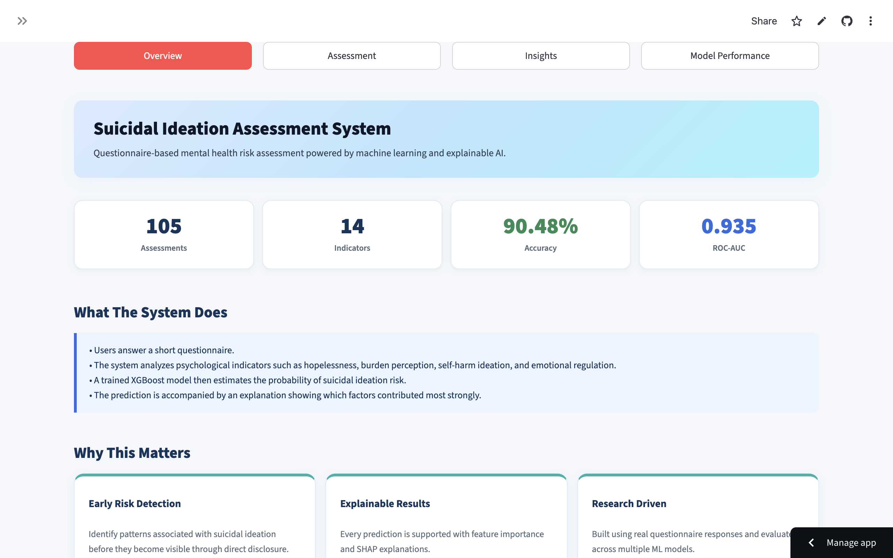

# Suicidal Ideation Assessment System (SIAS)



## Live Demo

🌐 Deployed Application
https://suicidal-ideation-assessment-system.streamlit.app

## Source Code

💻 GitHub Repository
https://github.com/Ur-ka-shi/suicidal-ideation-assessment-system

---

# Overview

The Suicidal Ideation Assessment System (SIAS) is an end-to-end machine learning application that predicts suicidal ideation risk using questionnaire-based psychological indicators.

The system allows users to complete a short assessment and receive:

* Risk probability estimation
* Risk classification (Low / High)
* Model prediction output
* Feature importance insights
* Explainable AI visualizations

The objective of this project is to demonstrate how machine learning and explainable AI techniques can be applied to mental health risk assessment in a transparent and interpretable manner.

---

# Key Features

### Questionnaire-Based Risk Assessment

Users answer a set of psychological and behavioral indicator questions related to:

* Emotional regulation
* Hopelessness
* Self-harm ideation
* Perceived burden
* Desire to live
* Social support

### Machine Learning Prediction

A trained XGBoost model analyzes user responses and predicts the probability of suicidal ideation risk.

### Explainable AI

Model behavior is interpreted using:

* SHAP (SHapley Additive Explanations)
* Feature Importance Analysis
* Comparative Model Evaluation

### Interactive Dashboard

The application is deployed using Streamlit and provides real-time predictions through a clean web interface.

---

# Dataset

The project uses a structured questionnaire dataset consisting of psychological indicators associated with suicidal ideation risk.

### Dataset Summary

| Attribute      | Value                |
| -------------- | -------------------- |
| Total Records  | 105                  |
| Features       | 14                   |
| Target Classes | Low Risk / High Risk |
| Format         | CSV                  |

Dataset File:

dataset.csv

---

# Machine Learning Workflow

1. Data Collection
2. Data Cleaning and Preprocessing
3. Feature Encoding
4. Model Training
5. Model Evaluation
6. Explainability Analysis
7. Deployment

---

# Models Evaluated

Three machine learning models were trained and compared.

| Model               | Accuracy | ROC-AUC | F1 Score |
| ------------------- | -------- | ------- | -------- |
| Logistic Regression | 81.0%    | 0.935   | 0.81     |
| Random Forest       | 86.0%    | 0.944   | 0.86     |
| XGBoost             | 90.48%   | 0.935   | 0.91     |

---

# Final Model Selection

### XGBoost Classifier

The XGBoost model was selected for deployment because it achieved:

* Highest validation accuracy (90.48%)
* Best F1-score (0.91)
* Strong overall classification performance

Although Random Forest achieved a slightly higher ROC-AUC score, XGBoost provided the strongest balance between accuracy and classification quality.

---

# Most Influential Predictors

Across all evaluated models, the following features consistently emerged as the strongest predictors:

1. Control over dark thoughts
2. Self-harm ideation
3. Hopelessness about the future
4. Perceived burden
5. Desire to live

These findings were further validated using SHAP explainability analysis.

---

# Explainable AI

To improve model transparency, SHAP (SHapley Additive Explanations) was used.

SHAP provides:

* Feature contribution analysis
* Global model interpretation
* Visual explanation of prediction behavior

This enables users to understand which factors most strongly influence model predictions.

---

# Technology Stack

### Machine Learning

* Python
* Scikit-Learn
* XGBoost

### Data Processing

* Pandas
* NumPy

### Explainability

* SHAP

### Deployment

* Streamlit

---

# Academic Context

This project was developed as part of a Bachelor of Technology (B.Tech) minor research study conducted at Usha Mittal Institute of Technology, SNDT Women’s University.

The work involved:

* Literature review of existing suicide prediction research
* Dataset preparation and preprocessing
* Comparative machine learning model evaluation
* Explainable AI analysis
* Deployment of a public-facing web application

---

# Project Structure

```text
Suicidal-Ideation-Assessment-System/
│
├── app.py
├── model.pkl
├── dataset.csv
├── requirements.txt
├── README.md
│
├── assets/
│   ├── shap_summary.jpeg
│   ├── roc_curve.jpeg
│   ├── xgb_features.jpeg
│   ├── xgb_confusion.jpeg
│   └── ...
│
└── notebook/
    └── Suicide_Ideation_Prediction.ipynb
```

# Running Locally

Clone the repository:

```bash
git clone https://github.com/Ur-ka-shi/suicidal-ideation-assessment-system.git
```

Move into the project folder:

```bash
cd suicidal-ideation-assessment-system
```

Install dependencies:

```bash
pip install -r requirements.txt
```

Run the application:

```bash
streamlit run app.py
```

---

# Future Improvements

* Increase dataset size and diversity
* Multi-class risk stratification (Low / Moderate / High)
* Probability calibration techniques
* Real-time SHAP explanations
* Clinician-focused analytics dashboard
* External validation on larger datasets

---

# Disclaimer

This project was developed for educational and research purposes.

The system is not a clinical diagnostic tool and should not be used as a substitute for professional mental health assessment, diagnosis, or treatment.

Any prediction generated by this application should be interpreted as a machine learning output and not as medical advice.
